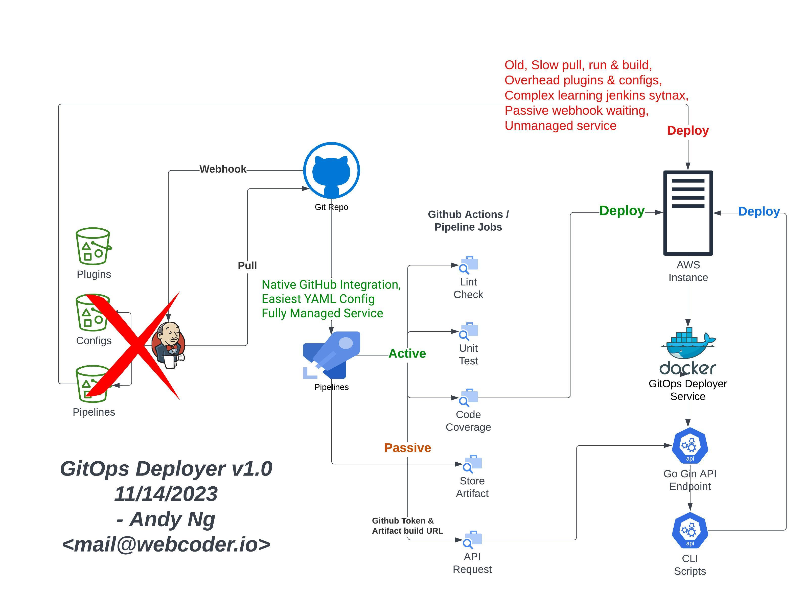

# GitOps Deployer
## Credit to: Andy Ng www.webcoder.io

Golang-powered Gin API, a DevOps powerhouse, excels in Git-to-server deployment, overcoming limitations and tailored for scenarios restricting direct SSH access, making it ideal for Docker microservices. Seamlessly integrate with GitHub Action pipelines for the fastest, Jenkins-killer bash-driven CI/CD in restricted environments, enhancing security constraints by pulling from GitHub releases. Master deployment with speed, security, and microservices finesse.

