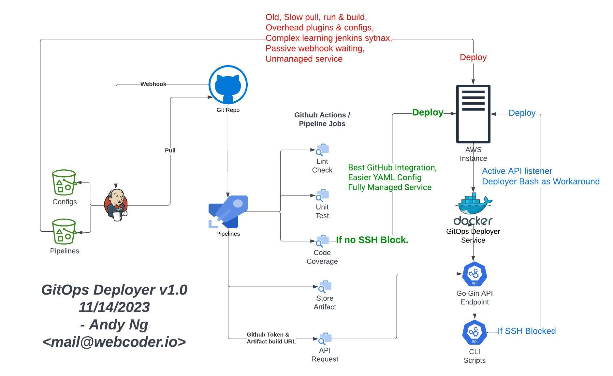

# GitOps Deployer

Credit to: Andy Ng www.webcoder.io

Golang-powered Gin API, a DevOps powerhouse, excels in Git-to-server deployment, overcoming Rsync/SCP limitations and tailored for scenarios restricting SSH access, making it ideal for Docker microservices. Seamlessly integrate with GitHub Action pipelines for the fastest, Jenkins-killer bash-driven CI/CD in restricted environments, enhancing security constraints by pulling from GitHub releases. Master deployment with speed, security, and microservices finesse.

Features:
- `make init` to initialize everythign for the first time only. (Do not run this again or it will remove all your service containers.)
- One-Command `make` to bring everything up: Docker, The deployer service.
- `make ssh` to exec the container, `make down` to bring the service down
- Port is on `8080` open and exposed. You may use nginx `proxy` or traefik redirect for redirect traffic if you cannot open extra port in your AWS.  

